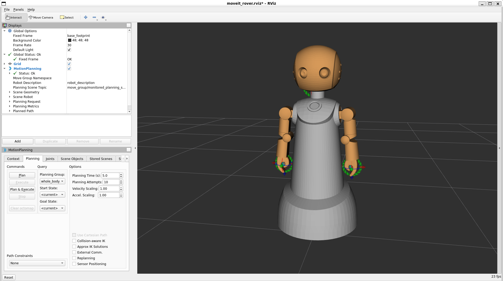

## 研究開発用ロボットプラットフォーム Robovie-R4 ROSパッケージ

<p align="center">
  
</p>

ヴイストン株式会社より発売されている開発研究用ロボットプラットフォーム「Robovie-R4」をROSで制御するためのSDKです。別途Linux搭載のPC及びロボット実機が必要になります。

Robovie-R4については、[製品ページ](https://www.vstone.co.jp/products/robovie_r4/index.html)をご覧ください。

## 目次
- [インストール方法](#インストール方法)
- [各パッケージの説明と利用方法](#各パッケージの説明と利用方法)
    - [r4\_control](#r4_control)
    - [r4\_description](#r4_description)
    - [r4\_motion](#r4_motion)
    - [r4\_moveit\_config](#r4_moveit_config)
      - [MoveIt](#moveit)
      - [Gazeboシミュレータ](#gazeboシミュレータ)
- [Robovie-R4の制御方法](#robovie-r4の制御方法)
  - [ROS（ROS1）メッセージ通信](#rosros1メッセージ通信)
      - [Subscribe](#subscribe)
      - [Publish](#publish)
  - [MoveIt＋RVizで動かす](#moveitrvizで動かす)

# インストール方法

- ROSのインストール方法は[こちら](http://wiki.ros.org/noetic/Installation/Ubuntu)を確認してください。
- catkin ワークスペースを作成
  ```bash
  mkdir -p ~/robovie_ws/src
  ```
- ワークスペースの`src`フォルダ内に移動し、本パッケージをクローンします。
  ```bash
  cd ~/robovie_ws/src
  git clone https://github.com/vstoneofficial/robovie_r4_ros.git
  ```
- Robovie-R4移動のための台車部分に研究開発用台車ロボットとして定評のある「[メガローバーVer.3.0](https://www.vstone.co.jp/products/wheelrobot/ver.3.0_normal.html)」を採用しています。\
  ROS上でRobovie-R4を動作したい場合、下記のパッケージが必要です。
  ```bash
  git clone https://github.com/vstoneofficial/megarover3_ros.git  # メガローバーVer.3.0のパッケージ
  git clone https://github.com/vstoneofficial/megarover_description.git  # メガローバーの3Dモデルのパッケージ 
  ```
- 依存関係にあるパッケージをインストールします。
  ```bash
  rosdep install -r -y --from-paths . --ignore-src
  ```
- ソースコードをビルドします。
  ```bash
  cd ~/robovie_ws
  catkin_make
  ```
- ワークスペースのオーバレイ作業
  ```bash
  source devel/setup.bash
  ```

以上で`robovie_r4_ros`パッケージのセットアップは完了です。

# 各パッケージの説明と利用方法
### r4_control
Robovie-R4をROS Controlで制御するパッケージ。\
以下のコマンドでRobovie-R4をROSと接続。
```
roslaunch r4_control bringup.launch
```

以下のコマンドでRobovie-R4をros_controlで制御する
```
roslaunch r4_control r4_control_HW.launch
```

実機を操作する前に、[RViz](http://wiki.ros.org/rviz)上で動作確認のためにこちらのノードを起動してください。

> **Warning**\
> 実機のRobovie-R4を操作する時に起動しないでください。

```
rosrun r4_control r4_sim_echo
```

### r4_description
Robovie-R4のモデルを表示するためのパッケージ。\
以下のコマンドで立ち上げます。
```
roslaunch r4_description display.launch
```
以下の画面が表示します。


### r4_motion
Robovie-R4のサンプルモーション（MoveItへ指令を出すノード）のパッケージ。\
各ノードの詳細は`src`フォルダーの各ファイルに記載されています。

### r4_moveit_config
Robovie-R4 MoveItの設定パッケージ
#### MoveIt
以下のコマンドでRViz上でMoveItを操作するデモを立ち上げてください。
```
roslaunch r4_moveit_config demo.launch
```


#### Gazeboシミュレータ
以下のコマンドでGazeboでRobovie-R4シミュレーションを起動します。
```
roslaunch r4_moveit_config gazebo.launch
```
MoveItで操作するGazeboのシミュレーションは次のコマンドで立ち上げてください。
```
roslaunch r4_moveit_config demo_gazebo.launch
```
> **Note**
> パラメータチューニングが必要な場合はあります。

# Robovie-R4の制御方法
## ROS（ROS1）メッセージ通信
Robovie-R4 の subscribe（購読）するメッセージ、publish（配信）するメッセージの仕様は以下のようになります。
#### Subscribe
- `/r4/r4Cmd`
  - 内容
      ```
      int16[11] angle # 各軸の目標角度の指令値 [0.1 deg]
      uint16[3] led # 目のLED（R, G, B）
      int16 time # 目標角度までの遷移時間 [16.667 msec]
      ```
      
#### Publish
- `/r4/r4Sensor`
  - 内容
      ```
      int16[11] angle # 各軸の現在角度 [0.1 deg]
      ```
      

## MoveIt＋RVizで動かす
上記の [r4\_control](#r4_control) のコマンドを実行してから、GUI上の操作が可能です。
MoveItの使い方の詳細は[公式のドキュメント](https://ros-planning.github.io/moveit_tutorials/index.html)を参照してください。
